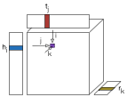
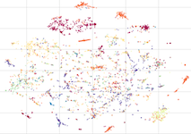
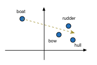

tf_rl_tutorial
===================

|  |  |  |
| ------------------------- | ---------------------------- | --------------------------- |

Accompanying code for "Relational Learning with TensorFlow" tutorial

The tutorial can be be viewed here: http://nbviewer.jupyter.org/github/fireeye/tf_rl_tutorial/blob/master/tf_rl_tutorial.ipynb

Please use the nbviewer link above instead of viewing the notebook directly from this GitHub repo. The GitHub renderer won't correctly display the images, equations, nor the scatter plot.

## Requirements
* TensorFlow: http://www.tensorflow.org/
* Numpy: http://www.numpy.org/
* Pandas: http://pandas.pydata.org/
